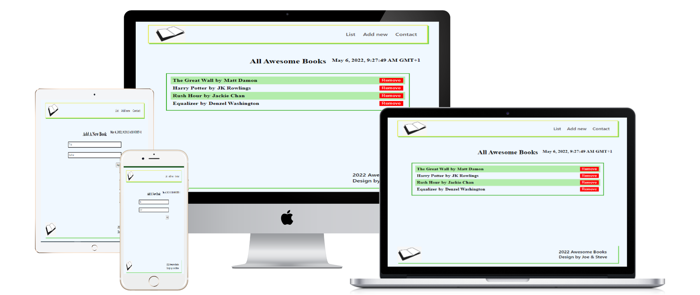

# Awesome Books Website

> The website has a collection of books with the Title and Author Name with a form to add books with title and author inputs and a button to remove a book.

## Built With

- HTML
- Javascript(ES6)
- CSS


## Screenshots 



## Live Demo 🔗

Check the live demo [here](https://braincee.github.io/Awesome-Books-with-ES6/#)👈


To get a local copy up and running follow these simple example steps.

1. Clone Repository
   ```
   git clone git@github.com:https://github.com/braincee/Awesome-Books.git
   ```

### Install linters(webhint, stylelint, eslint)

1. Run to install webhint
   ```
   npm install --save-dev hint@6.x
   ```
2. Run to install stylelint
   ```
   npm install --save-dev stylelint@13.x stylelint-scss@3.x stylelint-config-standard@21.x stylelint-csstree-validator@1.x
   ```
3. Run to install eslint
   ```
   npm install --save-dev eslint@7.x eslint-config-airbnb-base@14.x eslint-plugin-import@2.x babel-eslint@10.x
   ```

## Authors

👤 **Stephen**

- GitHub: [@braincee](https://github.com/braincee)
- Twitter: [@annor0543](https://twitter.com/annor0543)
- LinkedIn: [Stephen Annor](https://www.linkedin.com/in/kwesi-appiah-1387801a1/)

👤 **JODRACK**

- GitHub: [@joseph07-drack](https://github.com/joseph07-drack)
- LinkedIn: [joseph](https://www.linkedin.com/in/joseph-buingo-ab2682225/)

## 🤝 Contributing

Contributions, issues, and feature requests are welcome!

Feel free to check the [issues page](https://github.com/braincee/Awesome-Books-with-ES6/issues).

## Show your support.

Give a ⭐️ if you like this project!

## Acknowledgments

- README template from [Microverse](https://github.com/microverseinc/readme-template)
- Linter setup from [Microverse](https://github.com/microverseinc/linters-config/tree/master/html-css)

## 📝 License

This project is [MIT](./MIT.md) licensed.